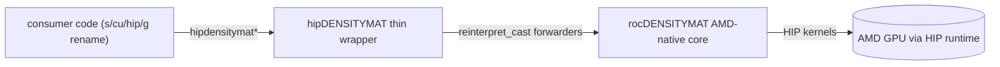

# hipDENSITYMAT

`hipDENSITYMAT` is the AMD-only thin C wrapper around
[`rocDENSITYMAT`](../rocdensitymat/), the AMD-native quantum
density-matrix simulation library. The header surface mirrors
NVIDIA's cuDensityMat 0.1.0 / cuQuantum 24.11 public C API exactly so
that consumer code written against `<cudensitymat.h>` ports with a
mechanical `s/cu/hip/g` rename.



- AMD-only from day one: the wrapper depends only on `hip::host` and
  `roc::rocdensitymat`; no NVIDIA runtime is linked.
- Numeric values of every shared status code, enum, and typedef are
  identical to cuDensityMat / rocDENSITYMAT so handles and arrays of
  handles forward by `reinterpret_cast`.
- v0.1.0 ships a functional single-GPU operator-action compute pipeline
  + a fixed-step RK4 master-equation stepper. The same v0.2 deferral list
  as rocDENSITYMAT applies; see [CHANGELOG.md](CHANGELOG.md).

## Build and install

```bash
mkdir build && cd build
cmake -DBUILD_CLIENTS_TESTS=ON -DBUILD_CLIENTS_SAMPLES=ON ..
make -j
ctest
```

The build expects a sibling `rocDENSITYMAT` install (or, when built under
the ROCm-libraries superbuild, the in-tree `roc::rocdensitymat` target).

## Quick start

```cpp
#include <hipdensitymat.h>

hipdensitymatHandle_t h = nullptr;
hipdensitymatCreate(&h);
// ... build operator, state, workspace, RK4 solver as you would in
// cuDensityMat ...
hipdensitymatDestroy(h);
```
